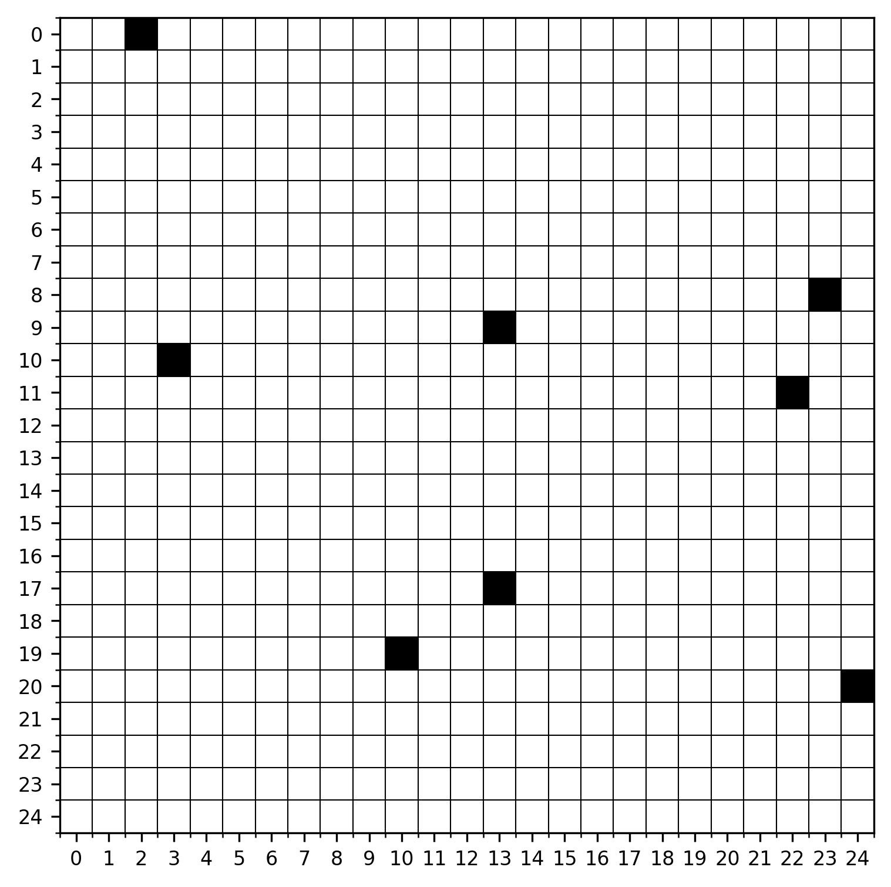
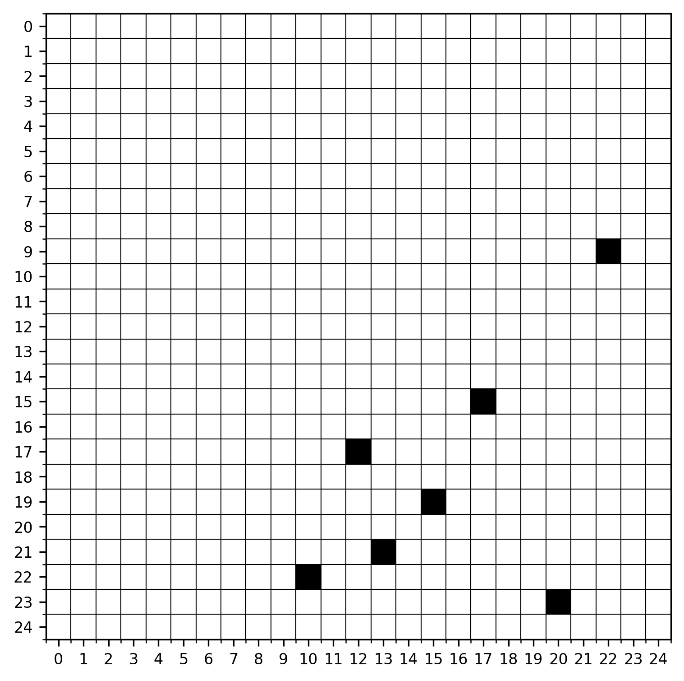
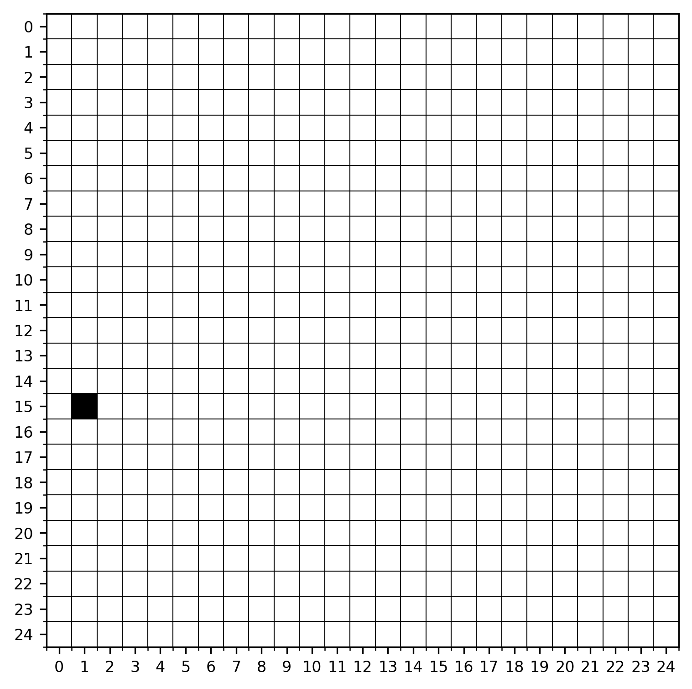
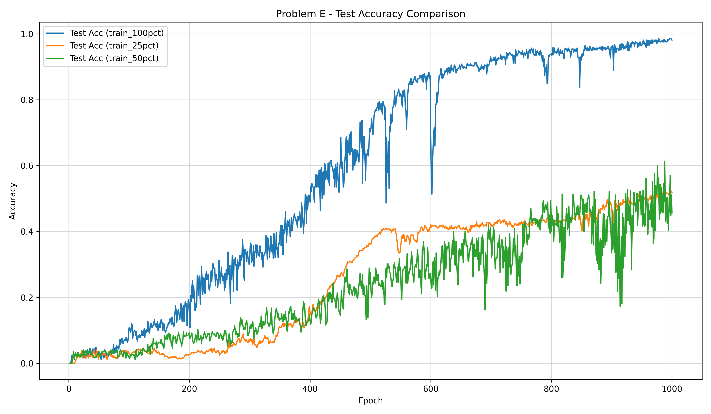
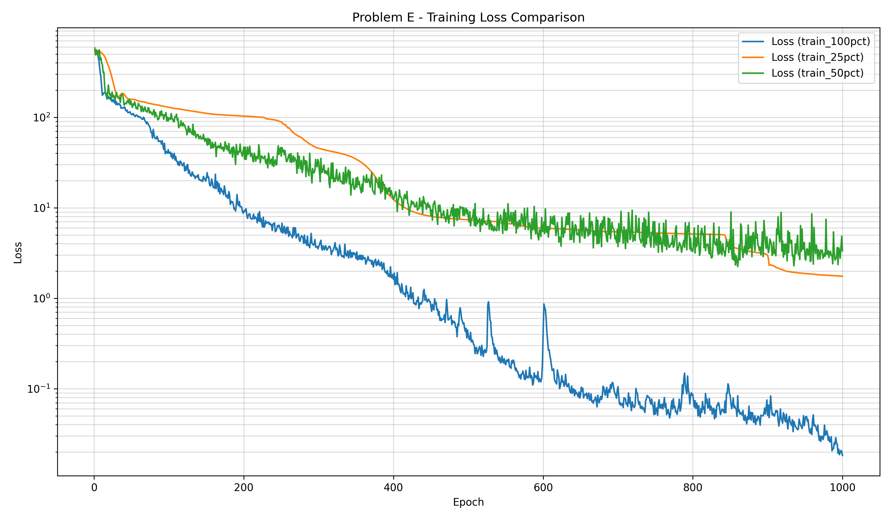

# Yapay Zeka Proje Ödevi

Bu proje, **25×25 boyutlu binary matrisler** üzerinde tanımlanan beş farklı yapay sinir ağı probleminin çözümünü içermektedir.

## Problemler

- **Problem A:** Birbirine **en yakın** iki nokta arasındaki Manhattan mesafesi
- **Problem B:** Birbirine **en uzak** iki nokta arasındaki Manhattan mesafesi
- **Problem C:** Matris içerisindeki **nokta sayısı**
- **Problem D:** Nokta sayısının **tek / çift** sınıfı
- **Problem E:** Nokta sayısına bağlı **koşullu Manhattan mesafesi**

## Kullanılan Modeller

- **Problem A & B:** İlişkisel (Relational Network benzeri) model  
- **Problem C:** CNN tabanlı model  
- **Problem D:** Self-Attention tabanlı model  
- **Problem E:** Koordinat + Attention tabanlı model  

Modeller, veri miktarının etkisini incelemek amacıyla **%25, %50 ve %100 eğitim kümeleri** ile ayrı ayrı eğitilmiştir.

## Örnek Girdi Matrisi

<p align="center">
  
  
  
</p>

## Problem E — Sonuç Örneği

<p align="center">
  
  
</p>

### Problem E — Yanlış Sayıları

| Eğitim  | Eğitim Boyutu | Test Doğruluğu | MAE   | Yanlış |
| ------- | ------------- | -------------- | ----- | ------ |
| 25.00%  | 296           | 51.89%         | 0.916 | 178    |
| 50.00%  | 555           | 45.68%         | 1.086 | 201    |
| 100.00% | 1110          | 98.11%         | 0.022 | 7      |

## Kullanım

Tüm problemleri varsayılan ayarlarla çalıştırmak için:

```bash
python main.py
```

Belirli problemleri çalıştırmak için:

```bash
python main.py --problems A C E
```

Özel parametrelerle kullanım:

```bash
python main.py \
    --data-dir data \
    --results-dir results \
    --epochs 1000 \
    --train-fractions 0.25 0.50 1.00 \
    --seed 24
```

### Parametreler

| Parametre           | Açıklama                                   |
| ------------------- | ------------------------------------------ |
| `--problems`        | Çalıştırılacak problemler (`A B C D E`)    |
| `--data-dir`        | Veri seti klasörü                          |
| `--results-dir`     | Sonuçların kaydedileceği klasör            |
| `--epochs`          | Tüm modeller için epoch override değeri    |
| `--train-fractions` | Eğitim verisi oranları                     |
| `--seed`            | Tekrarlanabilirlik için rastgelelik tohumu |

